# AURORA Dual-Rate VLA Control

Reference implementation for **AURORA: Asynchronous Dual-Rate Vision-Language-Action Control for Edge-Deployed Collaborative Mobile Manipulators**.

This repository turns the AURORA session export into a GitHub-ready artifact: a runnable implementation of the planner-controller boundary, safety gating, clock alignment, a deterministic semantic-planner mock, a reactive-controller mock, benchmark data, generated experiment figures, and the scientific paper draft.

The private 7B VLA checkpoint, 88M TensorRT controller engine, Isaac Lab environments, robot bags, and real robot drivers are **not** included. The code here is a faithful reference scaffold for the architecture and runtime contracts, not a drop-in release of the internal robot stack.

## What This Implements

- `AuroraIntent`: compact System-2-to-System-1 intent records with sequence numbers, TTL, and CRC32 integrity checks.
- `IntentRing`: fixed-slot ring buffer that accepts only fresh, valid semantic intent.
- `MockSemanticPlanner`: deterministic stand-in for the 7B semantic planner that maps language to intent flags and latents.
- `ReactiveController`: deterministic stand-in for the 88M controller, including ACT-style horizon-8 action chunks and actuator-delay compensation.
- `SafetyCritic`: controller-side hard vetoes for force, stale intent, peer exclusion, drawer side load, occupancy uncertainty, and unknown peer gripper state.
- `CameraClockAligner`: USB host-stamp delay estimator for mixed camera clock domains.
- `AuroraPipeline`: single-robot wiring of semantic planner, intent ring, reactive controller, and safety critic.
- Benchmarks and generated figures matching the reported AURORA session results.

## Architecture Explanation Graph

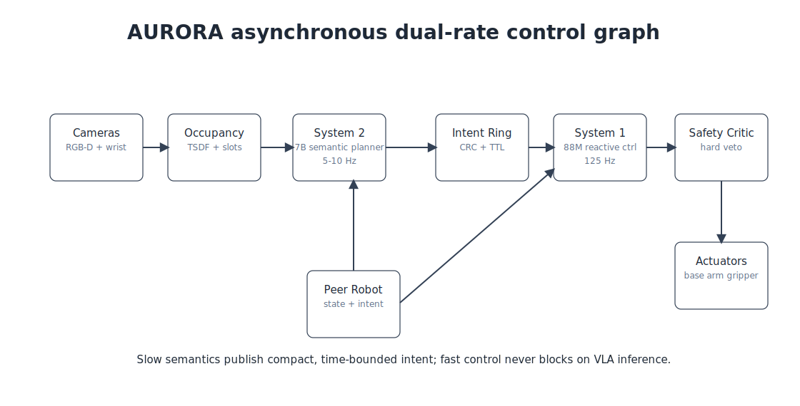

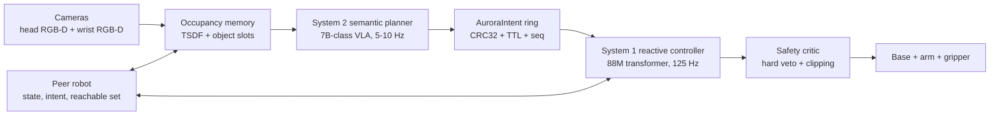

The design intentionally keeps the VLA out of the servo loop. System 2 performs slow language grounding, object selection, affordance prediction, and task-mode selection. System 1 runs at the control rate, consumes the newest valid intent, and falls back to hold/recovery behavior when semantic state is stale or unsafe.

## Quick Start

```bash
git clone <your-fork-or-new-repo-url> aurora-dual-rate-vla
cd aurora-dual-rate-vla

python3 -m venv .venv
source .venv/bin/activate
python3 -m pip install -e .

python3 -m aurora --language "handoff the flashlight, open the drawer, retrieve the wrench"
python3 -m unittest discover -s tests
```

Regenerate README figures:

```bash
python3 scripts/generate_figures.py
```

Extract real-run images from user-provided robot videos or exported camera frames:

```bash
python3 scripts/extract_real_images.py \
  --source /path/to/real/run/video_or_exported_frames \
  --run-id R-Apt-17 \
  --every-seconds 2 \
  --max-frames 24
```

Generate simulated AURORA robot runs and images:

```bash
python3 scripts/simulate_aurora_runs.py \
  --task drawer_tool \
  --run-id sim-drawer-tool-demo \
  --frames 12
```

## Minimal API Example

```python
from aurora.pipeline import AuroraPipeline
from aurora.reactive_controller import ControllerInput
from aurora.safety_critic import SafetyObservation
from aurora.semantic_planner import SemanticObservation

pipeline = AuroraPipeline()

pipeline.publish_semantics(
    SemanticObservation(
        language="Robot A holds the flashlight while Robot B retrieves the wrench"
    )
)

step = pipeline.control_step(
    ControllerInput(),
    SafetyObservation(peer_exclusion_distance=0.8),
)

print(step.safety_decision.allowed)
print(step.safety_decision.action_chunk[0])
```

## Repository Layout

```text
.
├── configs/
│   ├── aurora_edge_orin.yaml
│   └── domain_randomization.yaml
├── docs/assets/
│   ├── architecture.svg
│   ├── architecture_ablation.svg
│   ├── latency_profile.svg
│   ├── ppo_recovery.svg
│   ├── quantization_tradeoff.svg
│   ├── real_task_results.svg
│   └── sim_real_gap.svg
├── paper/
│   ├── aurora_paper.pdf
│   ├── aurora_paper.tex
│   └── references.bib
├── scripts/
│   ├── extract_real_images.py
│   ├── generate_figures.py
│   └── simulate_aurora_runs.py
├── src/aurora/
│   ├── clock_sync.py
│   ├── intent_ring.py
│   ├── pipeline.py
│   ├── reactive_controller.py
│   ├── safety_critic.py
│   ├── semantic_planner.py
│   └── types.py
└── tests/
```

## Runtime Contract

The core runtime object is `AuroraIntent`. Production AURORA used a larger fixed-size shared-memory record carrying object slots and affordance grids. This repository keeps the same contract that matters for the controller boundary:

1. Every intent has a monotonically increasing `seq`.
2. Every intent is timestamped in robot time.
3. Every intent has a TTL, defaulting to `420 ms`.
4. Every intent carries a CRC32 over its payload.
5. The controller accepts only the newest fresh record with a valid checksum.

This matters because a semantically correct plan can become physically dangerous when peer motion, drawer contact, or wrist-force evidence changes faster than the planner updates.

## Key Configuration

The reference edge config is in [`configs/aurora_edge_orin.yaml`](configs/aurora_edge_orin.yaml):

| Subsystem | Parameter | Value |
|---|---:|---:|
| Planner | target rate | 7.5 Hz |
| Planner | latent TTL | 420 ms |
| Controller | rate | 125 Hz |
| Controller | chunk horizon | 8 |
| Controller | execute stride | 2 |
| Controller | actuator delay | 24 ms |
| Safety | peer exclusion radius | 0.42 m |
| Safety | lateral soft veto | 36 N |
| Safety | axial soft veto | 52 N |
| Safety | hard force stop | 80 N |

## Benchmark and Experiment Figures

### Real Paired Trials

60 paired real trials, 15 per task family.

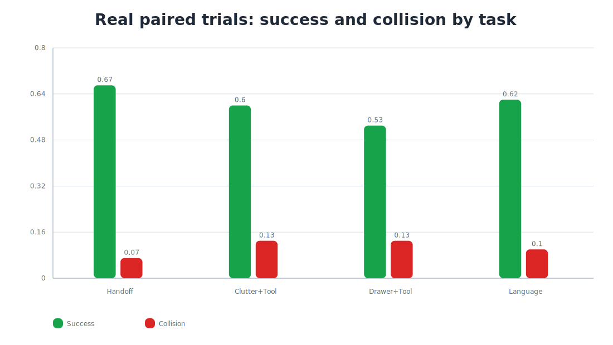

| Task | Trials | Success | Collision | Safety vetoes/trial |
|---|---:|---:|---:|---:|
| Collaborative handoff | 15 | 0.67 | 0.07 | 2.3 |
| Clutter clearing + retrieval | 15 | 0.60 | 0.13 | 3.1 |
| Drawer open + retrieve | 15 | 0.53 | 0.13 | 4.7 |
| Held-out language variants | 15 | 0.62 | 0.10 | 2.8 |
| Aggregate | 60 | 0.60 | 0.11 | 3.2 |

### Simulation vs Real Gap

480 held-out Isaac Lab episodes were compared with the 60 real trials.

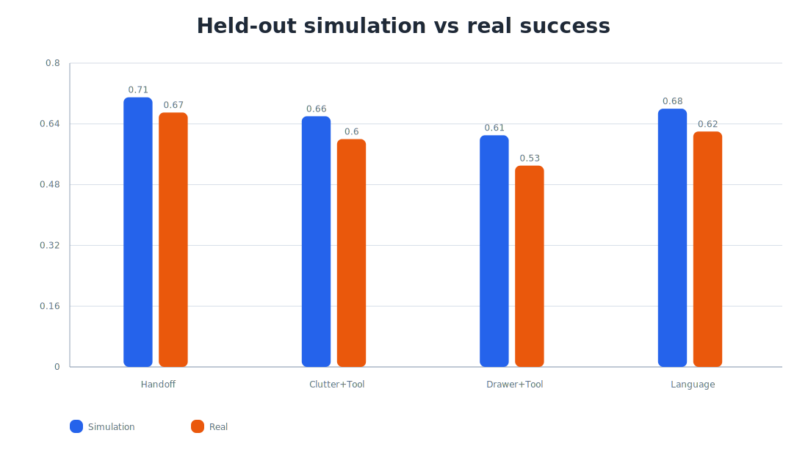

The reported sim-to-real gaps after hard-negative replay were roughly -0.04 to -0.08 across the four task families. Earlier drawer-opening experiments had a much larger gap before contact randomization and real failure replay.

### Architecture Ablation

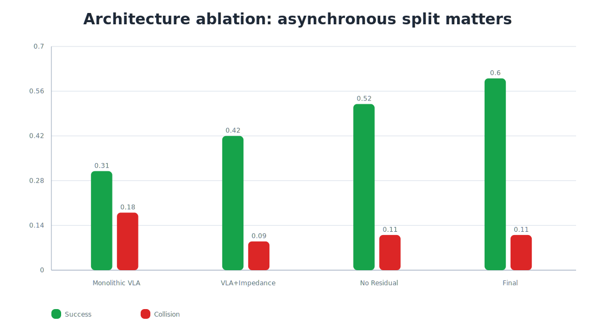

| Architecture | System 2 rate | System 1 rate | Real success | Collision | Comment |
|---|---:|---:|---:|---:|---|
| Monolithic VLA action decode | 1-3 Hz | n/a | 0.31 | 0.18 | stale actions, unsafe peer motion |
| VLA planner + classical impedance | 6 Hz | 125 Hz | 0.42 | 0.09 | safe but poor clutter recovery |
| VLA planner + 88M controller, no residual | 6 Hz | 125 Hz | 0.52 | 0.11 | failed grasps unrecovered |
| Final: VLA + 88M + PPO residual | 6 Hz | 125 Hz | 0.60 | 0.11 | best tradeoff |

### Edge Latency Profile

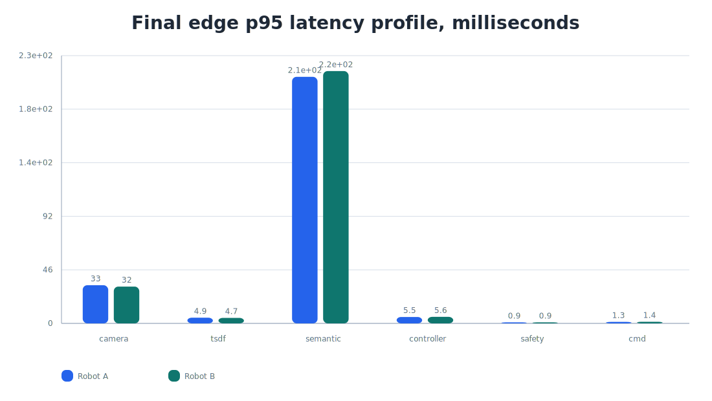

| Robot | Camera align p95 | TSDF p95 | Semantic p95 | Controller p95 | Safety p95 | Control miss |
|---|---:|---:|---:|---:|---:|---:|
| A | 32.8 ms | 4.9 ms | 211.8 ms | 5.5 ms | 0.9 ms | 0.74% |
| B | 31.6 ms | 4.7 ms | 216.7 ms | 5.6 ms | 0.9 ms | 0.82% |

The semantic planner still misses the nominal 160 ms p95 target. The architecture works because System 1 does not block on planner inference and rejects stale intent.

### Quantization Tradeoff

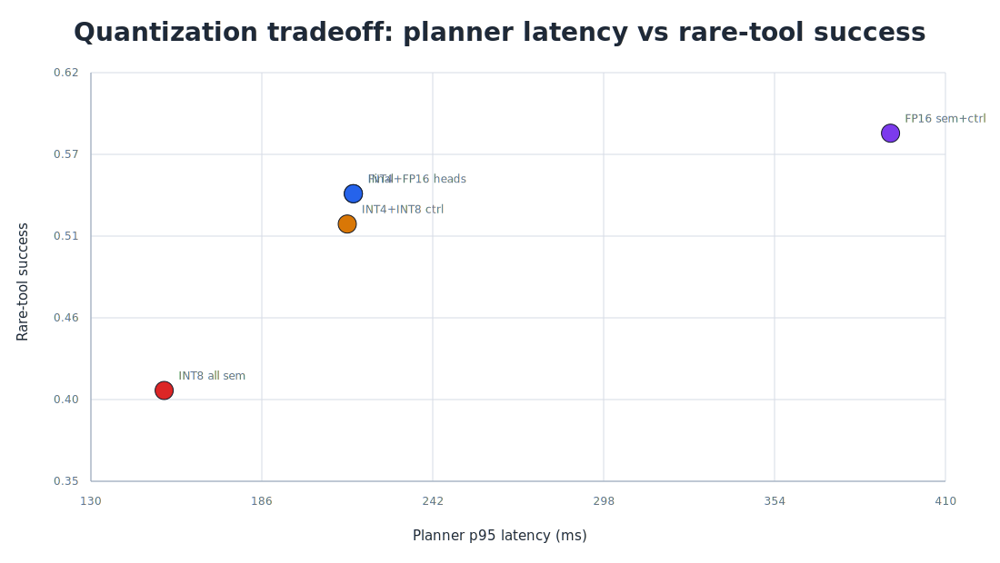

| Engine | Planner p95 | Controller p95 | Rare-tool success |
|---|---:|---:|---:|
| FP16 semantic + FP16 controller | 392 ms | 5.5 ms | 0.58 |
| INT8 semantic all layers | 154 ms | 5.5 ms | 0.41 |
| INT4 VLA + FP16 heads | 216 ms | 5.5 ms | 0.54 |
| INT4 VLA + INT8 controller | 214 ms | 4.6 ms | 0.52 |
| Final FP16 controller with graph | 216 ms | 5.6 ms | 0.54 |

The fastest semantic engine was not the deployed engine. INT8 over-compressed visual and object-slot heads, causing thin reflective tools to collapse into generic clutter slots.

### PPO Recovery Diagnostics

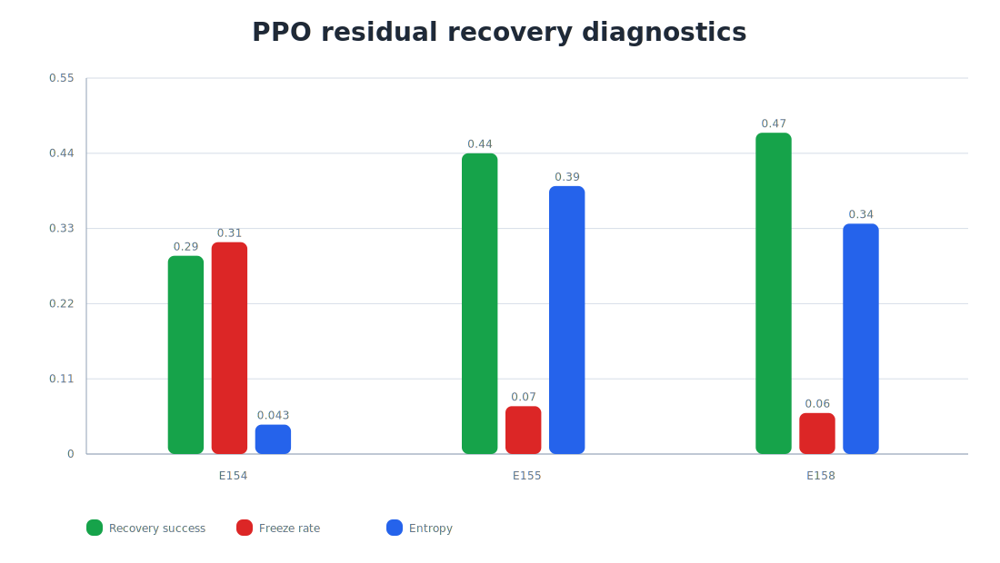

| Run | Entropy | Recovery success | Freeze rate |
|---|---:|---:|---:|
| E154 | 0.043 | 0.29 | 0.31 |
| E155 | 0.392 | 0.44 | 0.07 |
| E158 | 0.337 | 0.47 | 0.06 |

The fix was separate nominal/recovery advantage normalization, an entropy-floor schedule, and a lower GAE lambda for recovery episodes.

## Real Run Images

No real robot media is committed to this repository. That is deliberate: the session export did not include raw camera frames, and this repo should not fabricate “real” images.

When real run videos or exported camera-frame directories are available, use:

```bash
python3 scripts/extract_real_images.py \
  --source /path/to/R-Apt-17/robotA_wrist_rgb.mp4 \
  --run-id R-Apt-17-robotA-wrist-rgb \
  --every-seconds 1.5 \
  --max-frames 32 \
  --width 960
```

The script writes:

```text
docs/real_runs/<run-id>/
├── contact_sheet.svg
├── gallery.md
├── manifest.json
└── frames/
    ├── frame_0001.jpg
    ├── frame_0002.jpg
    └── ...
```

The manifest records the source path, extraction parameters, frame sizes, and SHA-256 checksums. ROS bag files are detected but skipped with a manifest note, because reliable extraction depends on topic names and message definitions. Convert image topics to videos or exported frame folders first, then run the extractor.

## Simulated Run Images

The repository includes deterministic simulation image runs generated by [`scripts/simulate_aurora_runs.py`](scripts/simulate_aurora_runs.py). These are useful for README visuals, debugging the planner-controller story, and making the benchmark section inspectable without access to the real robot logs.

They are explicitly labeled as synthetic simulation output.

### Handoff Simulation

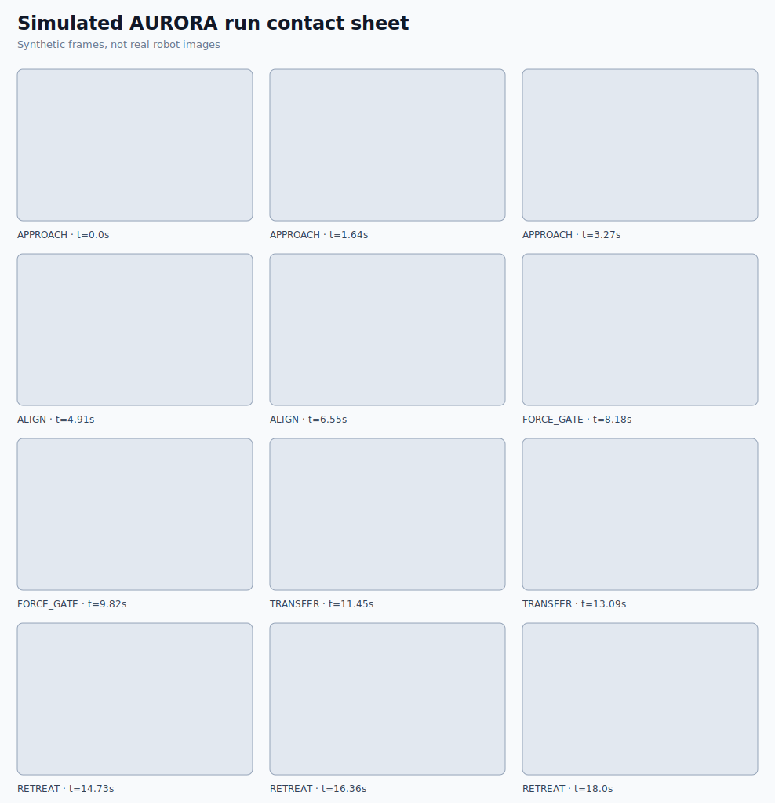

Gallery and manifest:

- [`docs/sim_runs/sim-handoff-demo/gallery.md`](docs/sim_runs/sim-handoff-demo/gallery.md)
- [`docs/sim_runs/sim-handoff-demo/manifest.json`](docs/sim_runs/sim-handoff-demo/manifest.json)

### Clutter Clearing + Tool Retrieval Simulation

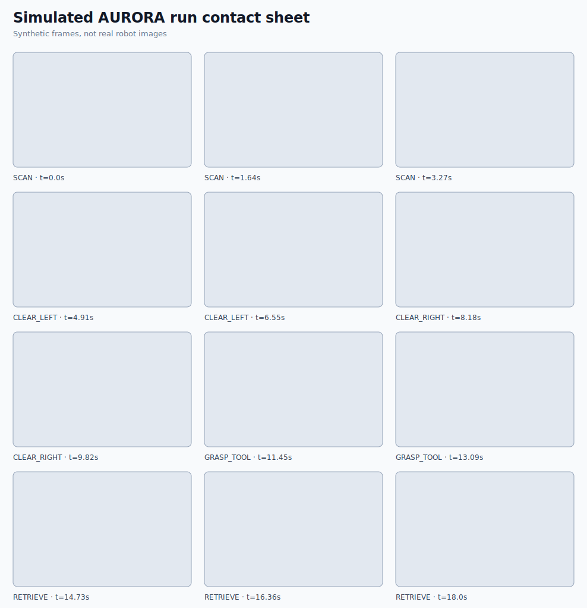

Gallery and manifest:

- [`docs/sim_runs/sim-clutter-tool-demo/gallery.md`](docs/sim_runs/sim-clutter-tool-demo/gallery.md)
- [`docs/sim_runs/sim-clutter-tool-demo/manifest.json`](docs/sim_runs/sim-clutter-tool-demo/manifest.json)

### Drawer Opening + Tool Retrieval Simulation

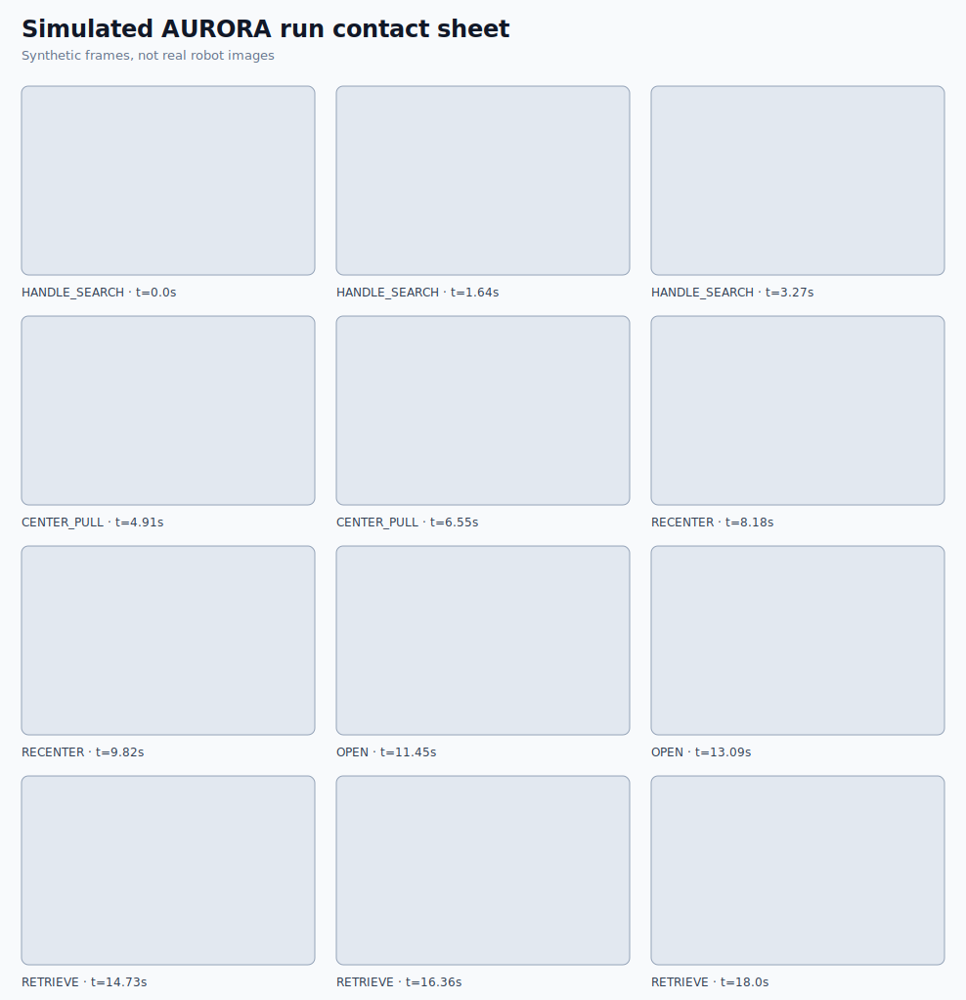

Gallery and manifest:

- [`docs/sim_runs/sim-drawer-tool-demo/gallery.md`](docs/sim_runs/sim-drawer-tool-demo/gallery.md)
- [`docs/sim_runs/sim-drawer-tool-demo/manifest.json`](docs/sim_runs/sim-drawer-tool-demo/manifest.json)

### Language Retarget Simulation

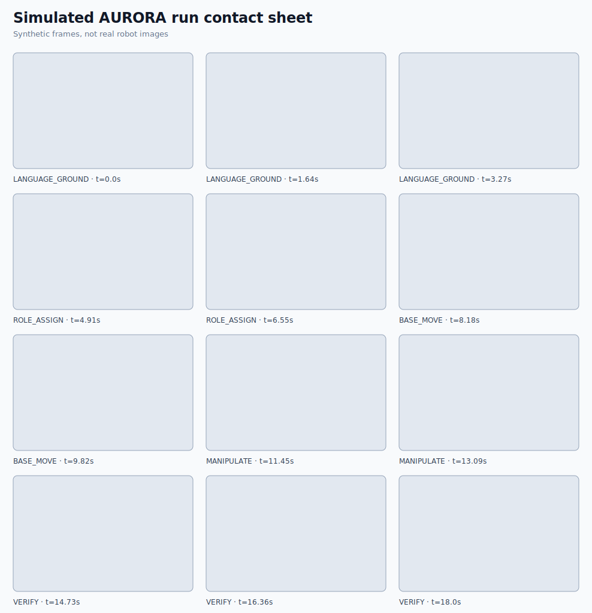

Gallery and manifest:

- [`docs/sim_runs/sim-language-demo/gallery.md`](docs/sim_runs/sim-language-demo/gallery.md)
- [`docs/sim_runs/sim-language-demo/manifest.json`](docs/sim_runs/sim-language-demo/manifest.json)

## Failure Modes Captured by the Implementation

- **Stale semantics:** `IntentRing` rejects intent older than the configured TTL.
- **Corrupt shared-memory payload:** `AuroraIntent.validate_crc()` fails if payload fields are modified after publishing.
- **Timestamp skew:** `CameraClockAligner` estimates host-stamp delay for USB camera frames.
- **Drawer side load:** `SafetyCritic` vetoes high lateral force in drawer mode.
- **Peer uncertainty:** `SafetyCritic` vetoes unknown peer gripper state and peer exclusion violations.
- **Occupancy uncertainty:** `SafetyCritic` falls back to hold when local occupancy uncertainty crosses the limit.

## What Is Mocked

| Production component | Repository substitute |
|---|---|
| 7B VLA semantic planner | `MockSemanticPlanner` with deterministic hashed latents |
| 88M TensorRT FP16 controller | `ReactiveController` deterministic control surrogate |
| PPO residual checkpoint | recovery flag behavior and safety-compatible action shaping |
| CUDA graph + TensorRT runtime | static Python implementation of the same dataflow |
| Isaac Lab tasks | benchmark constants and domain-randomization config |
| Robot drivers and ROS 2 launch | pure-Python pipeline and config files |

## Development

Run tests:

```bash
python3 -m unittest discover -s tests
```

Run the demo CLI:

```bash
python3 -m aurora --language "clear debris, open the drawer, retrieve the screwdriver"
```

Regenerate figures:

```bash
python3 scripts/generate_figures.py
```

Extract real-run images:

```bash
python3 scripts/extract_real_images.py --source /path/to/real/media --run-id R-Apt-17
```

Generate simulated run images:

```bash
python3 scripts/simulate_aurora_runs.py --task drawer_tool --run-id sim-drawer-tool-demo --frames 12
```

## Paper

The scientific paper draft is included in [`paper/aurora_paper.pdf`](paper/aurora_paper.pdf). The LaTeX source is in [`paper/aurora_paper.tex`](paper/aurora_paper.tex).

## Safety Notice

This repository is not a certified robot safety system. The included safety critic is a reference implementation of the logged hard-veto logic. Any real robot deployment needs independent hardware e-stops, validated calibration, deterministic communication, force limiting, operator procedures, and a formal hazard analysis.

## Citation

```bibtex
@misc{aurora2026dualrate,
  title = {AURORA: Asynchronous Dual-Rate Vision-Language-Action Control for Edge-Deployed Collaborative Mobile Manipulators},
  author = {AURORA Project Team},
  year = {2026},
  note = {Reference implementation and paper draft}
}
```
